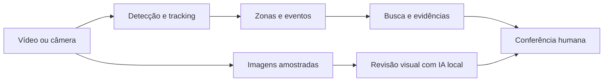

# Sentinel AI

**Vídeos e câmeras transformados em acontecimentos pesquisáveis, com evidências para revisão humana.**

Protótipo pessoal de Tharson Turbuk Silva, desenvolvido com apoio de IA para explorar um problema de operações de segurança: encontrar e conferir momentos relevantes sem revisar toda uma gravação manualmente.

## O que o projeto faz

- Recebe vídeo gravado, webcam local, fonte RTSP ou JPEGs de um cliente remoto.
- Detecta objetos e acompanha trajetórias com IDs temporários.
- Registra presença e permanência em zonas configuráveis.
- Permite buscar registros por período, câmera e tipo de acontecimento.
- Apresenta imagens para conferir os registros e consultar uma IA local.
- Oferece revisão humana e relatórios para apoiar a análise.

## Registros e análise são etapas diferentes

**Registros automáticos:** eventos gerados pelo detector, tracking e regras de zona. São a timeline do sistema. Perda de tracking não comprova saída física; IDs não identificam pessoas.

**Análise da IA:** há consultas aos registros estruturados e revisão visual de imagens amostradas da sessão. A revisão visual usa referências de quadros para sustentar observações. O modelo não recebe vídeo contínuo nem áudio e não pode confirmar intenção ou crime.



## Demonstração

As capturas de registros e da resposta visual serão adicionadas após selecionar uma gravação que possa ser exibida publicamente. Não há dados de usuários, vídeos de terceiros ou respostas inventadas neste repositório.

Para avaliar o código, não é necessário instalar os modelos. Para executar a análise completa, é necessário um computador com Python, modelos de visão e, para a resposta visual, um modelo multimodal local compatível. O GitHub apresenta o projeto; não hospeda o processamento de câmera.

## Tecnologias

Python · FastAPI · SQLite · OpenCV · Ultralytics YOLO · ByteTrack · Ollama · HTML/CSS/JavaScript.

Uma fonte de captura leve pode enviar imagens; a inferência acontece no servidor. Em uma câmera IP, a integração prevista é consumir o fluxo RTSP no servidor, sem instalar YOLO dentro da câmera. RTSP ainda depende de validação com equipamento real.

## Executar localmente

Python 3.11 ou superior. A configuração inicial abaixo usa CPU; GPU pode ser configurada depois com uma instalação de PyTorch apropriada ao hardware.

```powershell
python -m venv .venv
.\.venv\Scripts\python.exe -m pip install --upgrade pip
.\.venv\Scripts\python.exe -m pip install -e .
Copy-Item .env.example .env
```

Edite `API_KEY` no `.env` com uma chave aleatória própria. Os pesos gerais indicados por `MODEL_NAME` e `POSE_MODEL_NAME` podem ser baixados pelo Ultralytics na primeira utilização; isso requer internet e espaço em disco. Os pesos treinados localmente não acompanham este repositório.

Para a análise com IA, instale e execute Ollama e disponibilize o modelo multimodal definido em `LLM_MODEL`. A configuração usada no protótipo foi `qwen3.5:9b`; desempenho e memória variam conforme hardware. O detector e os registros são etapas separadas dessa consulta.

```powershell
.\.venv\Scripts\python.exe -m sentinel
```

Abra **http://127.0.0.1:8000/**. Use a chave configurada no acesso ao servidor. Uma câmera é processada por vez; mantenha um único worker.

### Testar um vídeo

1. Na configuração da fonte, escolha **Vídeo gravado**.
2. Selecione o arquivo e envie o vídeo; aguarde a confirmação.
3. Escolha o vídeo enviado e inicie o processamento.
4. Acompanhe a imagem e os registros. Depois selecione a sessão correspondente para consultar a análise visual.
5. Pergunte, por exemplo: **“Descreva as ações visíveis e cite os quadros que sustentam sua descrição.”**

Há referências de amostras públicas em [docs/video-sources.json](docs/video-sources.json). Use gravações próprias ou com autorização; os vídeos não são redistribuídos aqui. Arquivos maiores que o limite de upload precisam ser reduzidos ou configurados localmente.

## Avaliação documentada

No recorte local de MOT20 reservado para avaliação, com 96 imagens e 11.253 caixas anotadas de pedestres:

| Configuração | Precisão | Cobertura |
|---|---:|---:|
| Detector geral | 97,63% | 13,89% |
| Geral com reforço treinado de pessoas | 98,01% | 47,29% |

O reforço aumentou a cobertura nesse recorte, mas ainda houve 5.931 omissões e 108 falsos positivos. Não são métricas de reconhecimento de assaltos, pessoas únicas ou precisão em qualquer câmera. A versão publicada sem os pesos do especialista não reproduz essa combinação por padrão.

Veja [protocolo e limites do treinamento](docs/person-training.md), [avaliações anteriores](docs/trust-validation.md) e [proposta de busca com evidências](docs/search-product.md). Os arquivos brutos, datasets e checkpoints locais não são distribuídos; os relatórios documentam o experimento e não constituem um pacote completo de reprodução do treinamento.

### Testes de software

```powershell
.\.venv\Scripts\python.exe -m pip install pytest
.\.venv\Scripts\python.exe -m pytest tests -q
```

Os testes verificam regras, isolamento de sessões, API, avaliação e comportamento de componentes; não certificam o sistema para operação de segurança.

## Limites atuais

- Protótipo de apoio à revisão, sem certificação operacional.
- Não identifica pessoas nem confirma crimes, armas ou intenções.
- Imagens amostradas podem omitir ações rápidas; oclusão e baixa luz prejudicam a análise.
- Não há piloto empresarial nem economia de tempo ou dinheiro medida.
- Configuração, retenção, autenticação e infraestrutura precisam de revisão antes de um ambiente real.

## Arquivos e distribuição

O repositório inclui código, testes, configuração de exemplo e documentação selecionada. Chaves, bancos, gravações, modelos e arquivos da máquina de desenvolvimento foram excluídos. A cópia pública começa com um histórico limpo.

As dependências e os modelos possuem licenças próprias. O uso de Ultralytics exige considerar AGPL-3.0 ou as condições comerciais aplicáveis. Nenhuma licença de redistribuição dos pesos ou datasets é concedida por este README. `requirements-pc.txt` registra versões do ambiente de desenvolvimento; não é um lock universal de instalação.

## Autor

**Tharson Turbuk Silva** · [GitHub](https://github.com/Tharsonts)

Projeto pessoal desenvolvido com apoio de ferramentas de IA, com definição de requisitos, integração, testes e revisão dos resultados.
